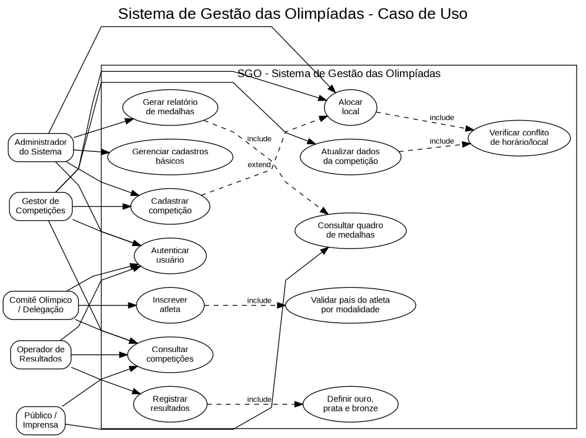
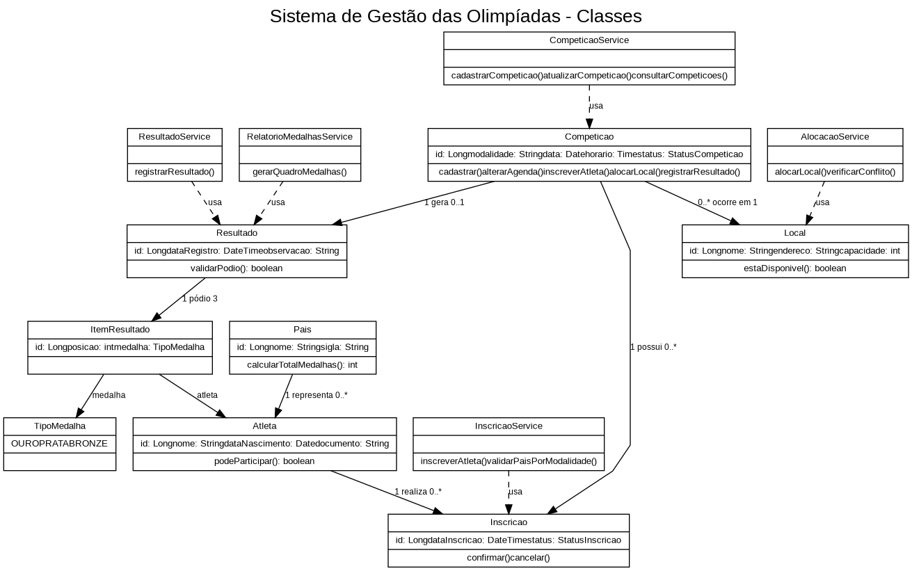
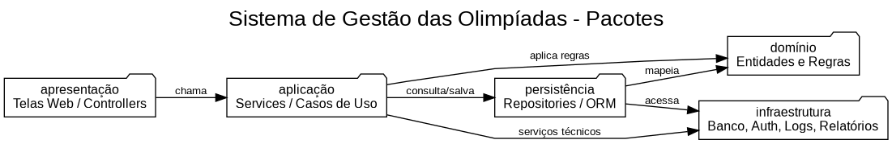
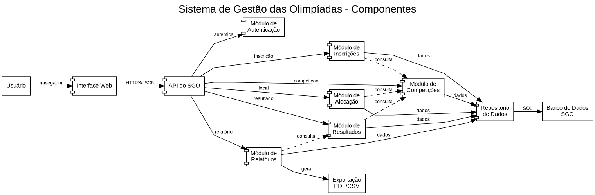
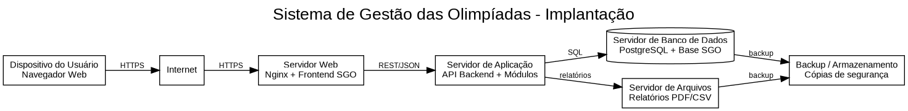

# Sistema de Gestão das Olimpíadas (SGO)

## Integrantes

- Ian Nycolas Fernandes Costa
- Caio Gabriel Lima Leal

## Sobre o projeto

Projeto em dupla entregue no dia 13/05/2026 para matéria de Projeto de Software

O **Sistema de Gestão das Olimpíadas (SGO)** foi pensado para ajudar na organização das competições olímpicas, reunindo em um só sistema o cadastro de competições, a inscrição de atletas, a alocação de locais, o registro de resultados e a emissão do quadro de medalhas.

A ideia principal é garantir que as informações fiquem organizadas e que algumas regras importantes sejam respeitadas, como evitar conflito de horário em um mesmo local e registrar corretamente os atletas classificados em primeiro, segundo e terceiro lugares.

## Objetivo do sistema

O sistema tem como objetivo apoiar a gestão das Olimpíadas, permitindo que os responsáveis pelo evento consigam:

- cadastrar competições por modalidade, data, horário e local;
- inscrever atletas de diferentes países nas competições;
- controlar a alocação dos locais das provas;
- registrar os resultados das competições;
- gerar relatórios de medalhas por país.

## Histórias de usuário

### US01 - Cadastrar competição

Como **gestor de competições**, quero cadastrar uma competição informando modalidade, data, horário e local, para que a prova fique registrada no calendário oficial do evento.

### US02 - Atualizar dados da competição

Como **gestor de competições**, quero alterar informações de uma competição já cadastrada, para corrigir ou atualizar dados como data, horário, local ou modalidade.

### US03 - Consultar competições

Como **usuário do sistema**, quero consultar as competições cadastradas, para acompanhar a programação das provas olímpicas.

### US04 - Inscrever atleta

Como **delegação ou comitê olímpico**, quero inscrever atletas em competições específicas, para que eles possam participar oficialmente das modalidades.

### US05 - Validar país do atleta por modalidade

Como **sistema**, quero validar se o atleta representa apenas um país em cada modalidade, para manter a regra de participação correta e evitar inconsistências.

### US06 - Alocar local da competição

Como **administrador do sistema**, quero alocar um local para uma competição, para definir onde a prova será realizada.

### US07 - Verificar conflito de horário e local

Como **sistema**, quero verificar se já existe outra competição no mesmo local e horário, para impedir que duas provas sejam marcadas no mesmo espaço ao mesmo tempo.

### US08 - Registrar resultado da competição

Como **operador de resultados**, quero registrar o resultado final de uma competição, informando os atletas classificados em primeiro, segundo e terceiro lugares.

### US09 - Gerar quadro de medalhas

Como **administrador ou gestor**, quero gerar um relatório de medalhas por país, para acompanhar o desempenho das delegações nas Olimpíadas.

### US10 - Consultar quadro de medalhas

Como **público ou imprensa**, quero consultar o quadro de medalhas, para visualizar a quantidade de medalhas de ouro, prata e bronze conquistadas por cada país.

### US11 - Gerenciar cadastros básicos

Como **administrador**, quero gerenciar dados básicos como países, atletas e locais, para manter a base do sistema atualizada.

## Regras de negócio consideradas

- Uma competição deve possuir modalidade, data, horário, local e lista de atletas inscritos.
- Um atleta pode participar de várias competições.
- Um atleta só pode representar um país em cada modalidade.
- Um local não pode receber duas competições no mesmo horário.
- O resultado de uma competição deve indicar ouro, prata e bronze.
- O relatório de medalhas deve consolidar o desempenho dos países de acordo com as medalhas conquistadas.

## Diagramas UML

### Diagrama de Caso de Uso



O diagrama de caso de uso apresenta os principais atores do sistema e suas interações com as funcionalidades principais do SGO.

### Diagrama de Classes



O diagrama de classes representa a estrutura principal do sistema, incluindo entidades como competição, atleta, país, local, inscrição e resultado.

### Diagrama de Pacotes



O diagrama de pacotes organiza o sistema em camadas, separando apresentação, aplicação, domínio, persistência e infraestrutura.

### Diagrama de Componentes



O diagrama de componentes mostra os módulos principais do sistema e como eles se comunicam para atender às funcionalidades necessárias.

### Diagrama de Implantação



O diagrama de implantação apresenta uma proposta de arquitetura física para uma aplicação web, com navegador, servidor web, servidor de aplicação, banco de dados e armazenamento de relatórios.

## Estrutura do repositório

```text
sgo-trabalho/
├── README.md
├── imagens/
│   ├── diagrama-de-caso-de-uso.png
│   ├── diagrama-de-classes.png
│   ├── diagrama-de-pacotes.png
│   ├── diagrama-de-componentes.png
│   └── diagrama-de-implantacao.png
└── codigos/
    ├── diagrama-de-caso-de-uso.puml
    ├── diagrama-de-classes.puml
    ├── diagrama-de-pacotes.puml
    ├── diagrama-de-componentes.puml
    ├── diagrama-de-implantacao.puml
    └── diagrama-de-implantação.puml
```

## Observação

Os arquivos `.puml` foram criados em PlantUML para permitir edição e geração dos diagramas novamente, caso seja necessário fazer ajustes no futuro.
